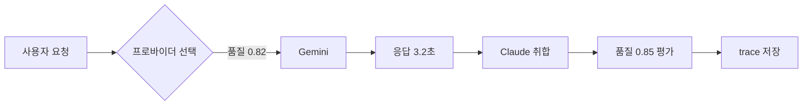

# 관측성 + 벤치마크 + 메모리 계층화 통합 설계

> 2026-03-04 | 접근법 A: 통합 학습 시스템

## 개요

4개 기능을 하나의 데이터 흐름으로 통합 설계한다:
1. **Trace 기록 시스템** — 모든 프로바이더 요청/응답을 자동 기록
2. **품질 벤치마크** — 취합/토론 시점에 자연스럽게 품질 평가 (추가 비용 0)
3. **Semantic Tracing + Mermaid 시각화** — 판단 이유 기록 + 흐름도 생성
4. **메모리 계층화** — session → vector → graph 순차 fallback

## 핵심 원칙

- **추가 토큰 비용 최소화**: 별도 교차검증 요청 없이, 이미 일어나는 작업 안에서 품질 평가
- **AI 내부 활용 우선**: trace 데이터를 AI가 라우팅/판단에 직접 참고
- **사용자도 조회 가능**: Mermaid 시각화 등으로 투명성 제공
- **자가수리(Self-Healing) 확장 대비**: trace 데이터 기반으로 향후 자동 복구 설계 가능

---

## 섹션 1: Trace 기록 시스템 (기반 레이어)

### 데이터 구조

```typescript
interface TraceRecord {
  traceId: string;              // 작업 단위 ID (UUID)
  timestamp: string;            // ISO 8601
  action: string;               // "chat" | "debate_turn" | "cross_validate" | "dispatch" 등
  providerId: string;           // "gemini" | "codex" | "ollama" 등
  task: string;                 // "code-review" | "analysis" | "debate" 등
  request: {
    promptSummary: string;      // 프롬프트 앞 100자 요약
    fileCount: number;
  };
  response: {
    success: boolean;
    charLength: number;         // 응답 글자 수 (토큰 대신 — 프로바이더 무관 공통 지표)
    error?: string;             // 실패 시 에러 메시지
  };
  latencyMs: number;
  quality?: {                   // 품질 평가 (취합/토론 시점에 채워짐)
    score: number;              // 0~1
    evaluator: string;          // 평가자 ID ("claude", "codex" 등)
    feedback: string;           // 한 줄 피드백
  };
  reasoning?: {                 // Semantic Tracing (선택 시점에 채워짐)
    candidateProviders: string[];
    selectedProvider: string;
    selectionReason: string;    // 1~2문장
    memoryHit: boolean;
    memoryContext?: string;
  };
}
```

### 저장

- **위치**: `.agestra/traces/YYYY-MM-DD.jsonl`
- **형식**: JSON Lines (한 줄 = 한 레코드)
- **보존**: 30일 (이후 자동 삭제)
- **토큰 대신 charLength 사용**: 프로바이더별 토크나이저가 달라 정확한 토큰 측정 불가. API가 usage를 돌려주면 별도 필드로 기록하되, 공통 비교 지표는 글자 수.

### 활용

- AI가 라우팅 시 최근 trace 조회 → 프로바이더별 작업 타입 평균 품질 참고
- 실패 패턴 감지 → 특정 프로바이더가 특정 작업에서 반복 실패 시 회피

---

## 섹션 2: 품질 벤치마크 (추가 비용 0)

### 품질 평가가 일어나는 시점

| 상황 | 평가 방식 | 추가 비용 |
|------|----------|----------|
| Claude 혼자 처리 | 평가 불필요 | 0 |
| 개별 리뷰 (각 AI가 따로) | Claude가 취합하면서 각 응답에 점수 부여 | 0 (어차피 취합함) |
| 끝장토론 | 토론 중 서로의 답변에 대한 동의/반론을 점수로 환산 | 0 (어차피 서로 봄) |

### 동작 흐름

```
프로바이더 응답 → trace에 기본 정보 기록 (latency, charLength, success)
     ↓
취합/토론 단계에서 quality 필드 채움 (score + feedback)
     ↓
누적 → 프로바이더별 작업 타입별 품질 통계
     ↓
다음 라우팅 시 ProviderCapabilityProfile에 반영
```

### 라우팅 반영

- `ProviderRegistry`에 `getQualityStats(providerId, taskType)` 메서드 추가
- 최근 N건의 quality.score 평균으로 가중치 조정
- 데이터 부족 시 기존 로직(모델 크기 기반) 유지

---

## 섹션 3: Semantic Tracing + Mermaid 시각화

### Semantic Tracing

trace 레코드의 `reasoning` 필드로 구현. 별도 시스템이 아니라 trace의 확장.

- `selectionReason`: Claude가 프로바이더를 선택하는 시점에 이미 알고 있는 정보를 1~2문장으로 기록
- `memoryHit` / `memoryContext`: 메모리에서 관련 정보를 찾았는지와 그 내용 요약
- 추가 AI 호출 없음 — 선택 시점의 판단 근거를 그대로 기록

### Mermaid 시각화

MCP 도구 `trace_visualize` 추가:
- 입력: traceId 또는 "최근 N건"
- 출력: Mermaid 다이어그램 문자열



- 사용자: "방금 작업 어떻게 처리됐어?" → 흐름도 반환
- AI 내부: reasoning 필드 참고하여 다음 라우팅 개선

### 추가 MCP 도구

| 도구 | 설명 |
|------|------|
| `trace_query` | 조건별 trace 조회 (providerId, task, 기간, 성공여부) |
| `trace_summary` | 프로바이더별/작업별 품질 통계 요약 |
| `trace_visualize` | traceId의 Mermaid 흐름도 생성 |

---

## 섹션 4: 메모리 계층화 (session → vector → graph)

### 3단계 순차 fallback

```
검색 요청 → L1 세션 캐시
              ├─ 찾음 → 반환 (0ms급)
              └─ 못 찾음 → L2 벡터 검색
                            ├─ 충분 → 반환 (수십ms)
                            └─ 부족 → L3 GraphRAG (수백ms)
```

| 계층 | 저장소 | 내용 | 속도 | 수명 |
|------|--------|------|------|------|
| L1 세션 | 메모리(Map) | 현재 대화 컨텍스트 | 즉시 | 대화 종료 시 삭제 |
| L2 벡터 | SQLite (기존 hybrid-search) | 의미 유사 과거 지식 | 빠름 | 영속 |
| L3 그래프 | SQLite (기존 GraphRAG) | 관계 추적 깊은 탐색 | 느림 | 영속 |

### 구현 방식

- 기존 코드 최소 변경: `MemoryFacade.search()` 앞에 L1 캐시 레이어 추가
- L2 → L3 전환 기준: 상위 결과의 relevance score가 임계값(0.7) 이상이면 L3 스킵
- L1 세션 캐시: 단순 Map + 키워드 매칭 (복잡한 검색 불필요)

### 우선순위

현재 성능 문제 없음 → 구현 순서에서 가장 마지막

---

## 구현 순서

| 단계 | 내용 | 의존성 |
|------|------|--------|
| 1 | Trace 기록 시스템 (JSONL 쓰기 + 자동 정리) | 없음 |
| 2 | 기존 프로바이더 호출에 trace 자동 기록 연동 | 단계 1 |
| 3 | 품질 평가 로직 (취합/토론 시 quality 필드 채우기) | 단계 2 |
| 4 | trace 기반 라우팅 개선 (quality stats → ProviderRegistry) | 단계 3 |
| 5 | Semantic Tracing (reasoning 필드 기록) | 단계 2 |
| 6 | MCP 도구 (trace_query, trace_summary, trace_visualize) | 단계 5 |
| 7 | 메모리 계층화 (L1 캐시 + fallback 로직) | 없음 (독립) |

---

## 새로 추가되는 파일 (예상)

```
packages/
├── core/
│   └── trace.ts              — TraceRecord 타입, TraceWriter (JSONL 쓰기/읽기/정리)
├── mcp-server/
│   └── tools/trace.ts        — trace_query, trace_summary, trace_visualize MCP 도구
└── memory/
    └── session-cache.ts      — L1 세션 캐시 레이어
```

## 수정되는 파일 (예상)

```
packages/
├── core/
│   └── registry.ts           — getQualityStats() 추가, 라우팅에 품질 반영
├── agents/
│   └── debate.ts             — 토론 턴에서 quality 기록
│   └── cross-validator.ts    — 검증 결과를 trace에 기록
├── mcp-server/
│   ├── server.ts             — 도구 호출 시 trace 자동 기록 미들웨어
│   └── tools/agent-session.ts — 취합 시 quality 필드 채우기
└── memory/
    ├── facade.ts             — search()에 L1 캐시 fallback 추가
    └── hybrid-search.ts      — "충분한 결과" 판단 로직 추가
```
